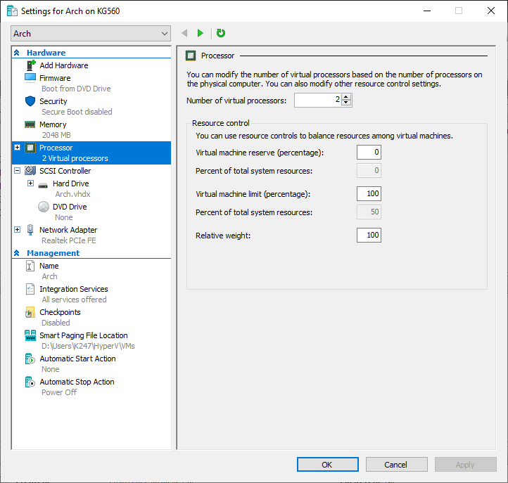

- ### [Setup Client](https://docs.microsoft.com/en-us/virtualization/hyper-v-on-windows/quick-start/quick-create-virtual-machine)

    - #### [Creating the virtual machine in Hyper-V Manager](#creating-the-virtual-machine-in-hyper-v-manager)  

    - #### [Specifying Hyper-V Generation 2 for a UEFI virtual machine](#specifying-hyper-v-generation-2-for-a-uefi-virtual-machine)  

 

 

 

 

 

    - #### [Setting Hardware Firmware Boot order, ensure Network Adapter is last](#setting-hardware-firmware-boot-order-ensure-network-adapter-is-last)  

    - #### [Disabling Secure Boot](#disabling-secure-boot)  

    - #### [Disabling Dynamic Memory & Specifying RAM size 2048 MB](#disabling-dynamic-memory--specifying-ram-size-2048-mb)  

    - #### [Setting Number of virtual processors 2 cores](#setting-number-of-virtual-processors-2-cores)  

    - #### [Setting Hard Drive 32GB / DvD Drive & Network Adapter](#setting-hard-drive-32gb--dvd-drive--network-adapter)  

 

 

    - #### [Setting Name 'Arch' & Description for virtual machine](#setting-name-arch--description-for-virtual-machine)  

    - #### [Enabling all Integrations Services](#enabling-all-integrations-services)  

    - #### [Disabling Checkpoints](#disabling-checkpoints)  

    - #### [Setting Automatic Start Action to Nothing](#setting-automatic-start-action-to-nothing)  

    - #### [Setting Automatic Stop Action to Power Off](#setting-automatic-stop-action-to-power-off)  

###### 
[Acknowledgments & Thanks](../../Acknowledgments.md) | [License](../../LICENSE.txt) | 

---
#EOF