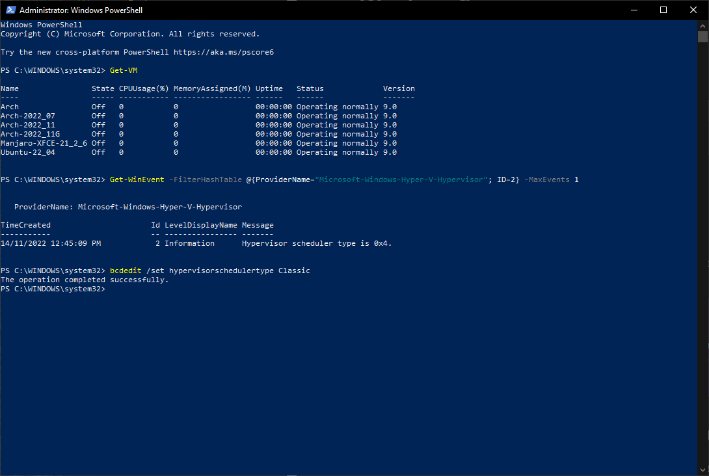

- ### [Setup Host](../setupHost/)

    - ### [Hyper-V Settings..](#hyper-v-setting)<br><br><p align="left"></p>

        - #### [Disabling Server NUMA Spanning](#disabling-server-numa-spanning)<br><br><p align="left"></p>

        - #### [Setting Server Enhanced Session Mode Policy](#setting-server-enhanced-session-mode-policy)<br><br><p align="left"></p>

        - #### [Setting User Enhanced Session Mode](#setting-user-enhanced-session-mode)<br><br><p align="left"></p>

    - ### [Virtual Switch Manager..](https://docs.microsoft.com/en-us/virtualization/hyper-v-on-windows/quick-start/connect-to-network)

        - #### [Creating the Internal / External Network Switch](#creating-the-internal--external-network-switch)<br><br><p align="left"></p>

        ensure Internal / External Network Switch has access to internet, before assigning it to a virtual machine..
      ### [Configuring the hypervisor scheduler type](#Configuring-the-hypervisor-scheduler-type)

      #### Selecting the hypervisor scheduler type - Classic<br>
      > The hypervisor scheduler configuration is controlled via the hypervisorschedulertype BCD entry.<br>
      To select a scheduler type, open a command prompt or powershell with administrator privileges:<br>
      ```console
      # bcdedit /set hypervisorschedulertype type
      ```
      > Where `type` is one of:<br>Classic<br>Core<br>Root<br><br>The system must be rebooted for any changes to the hypervisor scheduler type to take effect.
      
      <p align="left"></p>

      more info... [Managing Hyper-V hypervisor scheduler types](https://learn.microsoft.com/en-us/windows-server/virtualization/hyper-v/manage/manage-hyper-v-scheduler-types#virtual-machine-cpu-resource-controls-and-the-root-scheduler)

###### <p align="right">[Acknowledgments & Thanks](../../Acknowledgments.md) | [License](../../LICENSE.txt) | [](https://github.com/k247tEK/archVM-Hyper-V/tree/master/2022-06)</p>

---
#EOF