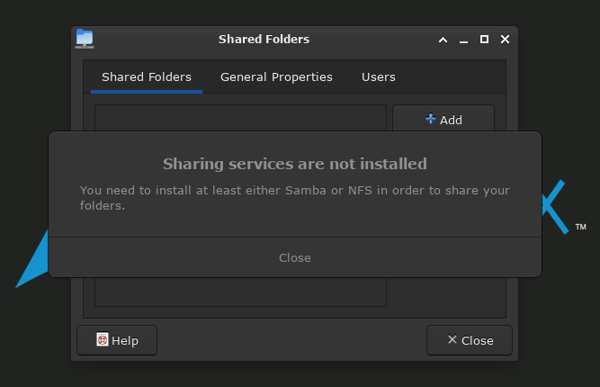

# [Shared Folders](#shared-folders)

`Shared Folders` from `gnome-system-tools`, is currently not working in xfce-Desktop and sooo.. can be hidden from application menu.. <br>
see.. [Hide Applications from menu in xfce-Desktop](../#hideapps)

<p align="left"></p>

even though `samba` has been installed, `Usershares` has to be enabled..

ref: https://wiki.archlinux.org/title/Samba#Enable_Usershares 

> Usershares is a feature that gives non-root users the capability to add, modify, and delete their own share definitions.

Create a folder for usershares

```console
$ sudo mkdir /var/lib/samba/usershares
```

Change the owner of the folder to `root` and the group to `sambashare`

```console
$ sudo chown root:sambashare /var/lib/samba/usershares
```

Change the permissions of the `usershares` folder so that users in the group `sambashare` can create files. <br>
This command also sets [sticky bit](https://en.wikipedia.org/wiki/Sticky_bit), which is important to prevent users from deleting usershares of other users

```console
$ sudo chmod 1770 /var/lib/samba/usershares
```

```
[k247@archlinux ~]
$ ll /var/lib/samba/
total 1.4M
drwxr-xr-x  5 root root       4.0K Jul 14 12:46 ./
drwxr-xr-x 23 root root       4.0K Jul 14 14:23 ../
-rw-------  1 root root       412K Jul  2 11:01 account_policy.tdb
drwxrwx---  2 root root       4.0K Jun 13 09:45 bind-dns/
-rw-------  1 root root        696 Jul  2 11:01 group_mapping.tdb
drwx------  3 root root       4.0K Jul  2 11:09 private/
-rw-------  1 root root       516K Jul 14 13:08 registry.tdb
-rw-------  1 root root       412K Jul 14 13:08 share_info.tdb
drwxrwx--T  2 root sambashare 4.0K Jul 14 15:28 usershares/
[k247@archlinux ~]
```

now.. Set the following parameters in the `smb.conf` configuration file

```console
$ sudo nano /etc/samba/smb.conf
```

```
...
[global]

# usershare
  usershare path = /var/lib/samba/usershares
  usershare max shares = 100
  usershare allow guests = yes
  usershare owner only = yes
  ...
```
_Note: user was added to `sambashare` group when setting up samba server.._ see.. [Configure Samba server](https://github.com/k247tEK/arch22-06VM-Hyper-V#configure-samba-server)


Restart smb and nmb services

```console
$ sudo systemctl restart smb nmb
```

Log out and log back in.. or to be sure.. restart VM.. ;-]...

> If you want to share paths inside your home directory you must make it accessible for the group others.

now if you wish to right click on any folder and share it on the network..<br>
from `AUR`..

### [install Thunar - thunar-shares-plugin](#thunarsharesplugin)

ref: https://docs.xfce.org/xfce/thunar/thunar-shares-plugin

> thunar-shares-plugin allows you to quickly share a folder using Samba
from Thunar (the XFCE file manager) without requiring root access.

```console
$ yay -S thunar-shares-plugin
```

<p align="left"></p>

---
#EOF