# Arch Linux 2022-06 virtual machine on Windows10<br>Hyper-V with Enhanced Session Mode

ref: [Introduction to Hyper-V on Windows 10](https://docs.microsoft.com/en-us/virtualization/hyper-v-on-windows/about/), [archWiki - Hyper-V](https://wiki.archlinux.org/title/Hyper-V).

### Enabling Windows Hyper-V and OpenSSH Client features

_Note that Hyper-V is not available on the Windows 10 Home edition, and requires Windows 10 Pro or equivalent._ 

- ### [Enabling Hyper-V](https://docs.microsoft.com/en-us/virtualization/hyper-v-on-windows/quick-start/enable-hyper-v)

- ### [Enabling the built-in SSH client in Windows 10](https://docs.microsoft.com/en-us/windows-server/administration/openssh/openssh_install_firstuse) or [Setup WSL2](https://docs.microsoft.com/en-us/windows/wsl/install).

_Note: ssh client is only required if you wish to install guest OS using ssh session.._

- ### Setup Host

    - ### Hyper-V Settings..

        - #### Disabling Server NUMA Spanning

        - #### Setting Server Enhanced Session Mode Policy

        - #### Setting User Enhanced Session Mode

    - ### Virtual Switch Manager..

        - #### Creating the Internal / External Network Switch

- ### Setup Client

    - #### Creating the virtual machine in Hyper-V Manager

    - #### Setting Hyper-V Generation 2 for a UEFI virtual machine

    - #### Setting Hardware Firmware Boot order, ensure Network Adapter is last

    - #### Disabling Secure Boot

    - #### Disabling Dynamic Memory & Specifying RAM size 2048 MB

    - #### Setting Number of virtual processors 2 cores

    - #### Setting Hard Drive 32GB / DvD Drive & Network Adapter

    - #### Setting Name 'Arch' & Description for virtual machine

    - #### Enabling all Integrations Services

    - #### Disabling Checkpoints

    - #### Setting Automatic Start Action to Nothing

    - #### Setting Automatic Stop Action to Power Off

#### <p align="center"> _Note: check all settings before powering on virtual machine and connecting to it.._</p>

##### <p align="center"> [ Host h/w : Lenovo Ideapad G560-M274YGE - Intel Core i5-450M (2.40GHz, 2 cores - 4 threads),<br>8GB (DDR3 1066MHz), NVIDIA GeForce 310M ]</p><br>

---

## <p align="center">[First Boot of virtual machine & installing OS](#firstboot)</p>

<p align="center"></p>

Arch linux 2022-06 now includes [archinstall](https://wiki.archlinux.org/title/Archinstall).<br>
This guided installer will perform (query) the following steps:

- configure the locale;
- select the mirrors;
- partition the disks;
- format the partitions;
- enable disk encryption (optional);
- set the hostname;
- set the root password;
- create users with sudo administrator authority
- install a boot loader.

### [Setting up SSH on the installation image](#setupsshinstall)

To setup OS using SSH session, set keyboard language, find IP address of virtual machine & set the root password.

- set your keyboard layout using `loadkeys`.

```console
# loadkeys uk
```

- Note down the DHCP-assigned IP address of the virtual machine.

```console
# ip addr
```

- Set the password of the root user so that you can connect to it via SSH.

```console
# passwd
```

_Note: sshd service must be running.._

```console
# systemctl enable --now sshd
```

check service has started and enabled..

```console
# systemctl status sshd
```

Now if you wish, you can connect to the installation image using the `root` account.

<br>

## [Install Arch Linux 2022-06 on the virtual machine](#archinstall)

_Note: to manually install arch, follow steps detailed in the wiki's [installation
guide](https://wiki.archlinux.org/index.php/Installation_guide)._<br>

#### Create Config folder to save installtion settings to..

```console
# mkdir /insCONFIG
```

#### & run archinstall...

```console
# archinstall
```

<!--
<p align='center'>
<iframe width="560" height="315" src="https://www.youtube.com/embed/KA16fFaSFv4" title="YouTube video player" frameborder="0" allow="accelerometer; autoplay; clipboard-write; encrypted-media; gyroscope; picture-in-picture" allowfullscreen></iframe>
</p>
-->

<p align="center"><a href="https://youtu.be/KA16fFaSFv4" target="_blank">
 
</a></p>

Note: after archinstall - chroot into installed system & copy `/insCONF` to root home folder.

```console
# cp -r /insCONFIG /mnt/archinstall/root/
```

then.. shutdown VM..

```console
# shutdown -h now
```

before restarting VM, remove ISO image file from DvD.. in Virtual Machines Settings..

<br>

## [post Installation configuration](#postinstall)

archinstall - has setup user k247 with sudo administrator authority & has disabled root account..<br>
Also sshd service has to be re-enabled & started:<br>

```console
$ sudo systemctl enable --now sshd
```

check service has started and enabled..

```console
$ sudo systemctl status sshd
```

SSH session can now be used to continue setup & customization of arch xfce-Desktop.

```console
$ ssh k247@192.168.0.100
```

<p align="center">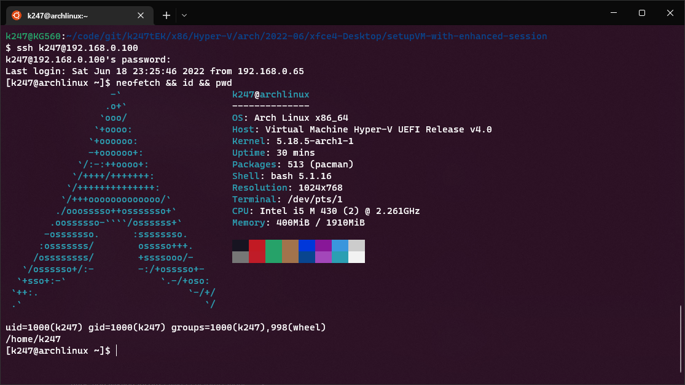</p>

#### Note: archinstall - optional user packages.. firefox htop lsof iftop net-tools lnav tmux neofetch mc

Check EFI setup..

```console
$ sudo efivar -l
$ ls -la /sys/firmware/efi
```

Check hard drive / Block storage..

```console
$ sudo lsblk
```

```console
$ sudo fdisk -l
```

### Apply a System Update..

```console
$ sudo pacman -Syu
```

<pre><code>:: Synchronising package databases...
 core is up to date
 extra is up to date
 community is up to date
 multilib-testing is up to date
 multilib is up to date
:: Starting full system upgrade...
 there is nothing to do
[k247@archlinux ~]$</code></pre>

add aliases, edit `~/.bashrc` file..

```console
$ nano ~/.bashrc
```

<pre><code>#
# ~/.bashrc
#

# If not running interactively, don't do anything
[[ $- != *i* ]] && return
###########################
alias l='ls -CF'
alias la='ls -ACF'
alias ll='ls -Flah'
#
alias lla='ls -FlAh'
alias lld='ls -lah -d */'
alias lsd='ls -d */'
#
alias ,,='cd -'
alias ..='cd ..'
#
alias cls='clear'
#
alias pblink='tput cvvis'
###########################
alias ls='ls --color=auto'
PS1='[\u@\h \W]\n\$ '
</code></pre>

save and exit with [Ctrl+x], then source `.bashrc` for changes to take effect..

```console
$ source .bashrc
```

test `ll` alias..
<pre><code>[k247@archlinux ~]
$ ll
total 64K
drwx------ 7 k247 k247 4.0K Jun 18 22:56 ./
drwxr-xr-x 3 root root 4.0K Jun 18 18:56 ../
-rw------- 1 k247 k247  476 Jun 19 00:11 .bash_history
-rw-r--r-- 1 k247 k247   21 Jan  8 18:31 .bash_logout
-rw-r--r-- 1 k247 k247   57 Jan  8 18:31 .bash_profile
-rw-r--r-- 1 k247 k247  407 Jun 19 00:20 .bashrc
drwxr-xr-x 5 k247 k247 4.0K Jun 18 23:41 .cache/
drwxr-xr-x 9 k247 k247 4.0K Jun 18 23:42 .config/
drwxr-xr-x 2 k247 k247 4.0K Jun 18 18:59 Desktop/
-rw-r--r-- 1 k247 k247   23 Jun 18 18:59 .dmrc
drwx------ 3 k247 k247 4.0K Jun 18 18:59 .gnupg/
-rw------- 1 k247 k247    0 Jun 18 18:59 .ICEauthority
drwxr-xr-x 3 k247 k247 4.0K Jun 18 18:59 .local/
-rw------- 1 k247 k247   54 Jun 18 22:56 .Xauthority
-rw------- 1 k247 k247 3.1K Jun 18 22:58 .xsession-errors
-rw------- 1 k247 k247 4.7K Jun 18 19:03 .xsession-errors.old
[k247@archlinux ~]
$ 
</code></pre>
_Note: $ prompt is in new line.._

### [check Root account access with sudo..](#chkrootacc)

```console
$ sudo su -
```

<pre><code>[k247@archlinux ~]
$ sudo su -
[sudo] password for k247:
[root@archlinux ~]# id
uid=0(root) gid=0(root) groups=0(root)
[root@archlinux ~]# pwd
/root
[root@archlinux ~]# ls -Flah
total 24K
drwx------  5 root root 4.0K Jun 18 23:00 ./
drwxr-xr-x 17 root root 4.0K Jun 18 18:45 ../
drwx------  3 root root 4.0K Jun 18 18:59 .cache/
drwx------  3 root root 4.0K Jun 18 18:46 .gnupg/
drwxr-xr-x  2 root root 4.0K Jun 18 18:57 insCONFIG/
-rw-------  1 root root   20 Jun 18 23:00 .lesshst
[root@archlinux ~]#</code></pre>

copy `.bashrc` & `.bash_profile` files from k247 home folder to root home folder..

```console
# cp /home/k247/.bashrc .
# cp /home/k247/.bash_profile .
# exit
```
use exit, to return to k247 bash shell..

### [creating Default directories](#createdefdir)

```console
$ sudo pacman -S xdg-user-dirs
$ cd
$ xdg-user-dirs-update
$ ll
```

###### _Note: see https://wiki.archlinux.org/title/XDG_user_directories#Creating_default_directories_

<pre><code>[k247@archlinux ~]
$ ll
total 92K
drwx------ 14 k247 k247 4.0K Jun 19 00:59 ./
drwxr-xr-x  3 root root 4.0K Jun 18 18:56 ../
-rw-------  1 k247 k247  476 Jun 19 00:11 .bash_history
-rw-r--r--  1 k247 k247   21 Jan  8 18:31 .bash_logout
-rw-r--r--  1 k247 k247   57 Jan  8 18:31 .bash_profile
-rw-r--r--  1 k247 k247  407 Jun 19 00:20 .bashrc
drwxr-xr-x  5 k247 k247 4.0K Jun 18 23:41 .cache/
drwxr-xr-x  9 k247 k247 4.0K Jun 19 00:59 .config/
drwxr-xr-x  2 k247 k247 4.0K Jun 18 18:59 Desktop/
-rw-r--r--  1 k247 k247   23 Jun 18 18:59 .dmrc
drwxr-xr-x  2 k247 k247 4.0K Jun 19 00:59 Documents/
drwxr-xr-x  2 k247 k247 4.0K Jun 19 00:59 Downloads/
drwx------  3 k247 k247 4.0K Jun 18 18:59 .gnupg/
-rw-------  1 k247 k247    0 Jun 18 18:59 .ICEauthority
drwxr-xr-x  3 k247 k247 4.0K Jun 18 18:59 .local/
drwxr-xr-x  2 k247 k247 4.0K Jun 19 00:59 Music/
drwxr-xr-x  2 k247 k247 4.0K Jun 19 00:59 Pictures/
drwxr-xr-x  2 k247 k247 4.0K Jun 19 00:59 Public/
drwxr-xr-x  2 k247 k247 4.0K Jun 19 00:59 Templates/
drwxr-xr-x  2 k247 k247 4.0K Jun 19 00:59 Videos/
-rw-------  1 k247 k247   54 Jun 18 22:56 .Xauthority
-rw-------  1 k247 k247 3.1K Jun 18 22:58 .xsession-errors
-rw-------  1 k247 k247 4.7K Jun 18 19:03 .xsession-errors.old
[k247@archlinux ~]
$
</code></pre>
now that user folders are setup, change to Downloads folder and setup yay..

```console
$ cd Downloads
```

> Yaourt is Dead! Use These Alternatives for AUR in Arch Linux<br>
ref: https://itsfoss.com/best-aur-helpers/

## [yay..](#yay)

>is the next best AUR helper written in Go with the objective of providing an interface of pacman with minimal user input, yaourt like search and with almost no dependencies.

make sure you have <b>git</b> & Required Packages to build yay..

```console
$ sudo pacman -S --needed git base-devel arch-repro-status
```

Download yay using git.. & make package..

```console
$ git clone https://aur.archlinux.org/yay.git
$ cd yay
$ makepkg -si
```

### [Update yay..](#updateyay)

```console
$ yay -Syu
```

<pre><code>:: Synchronising package databases...
 core is up to date
 extra is up to date
 community is up to date
 multilib-testing is up to date
 multilib is up to date
:: Starting full system upgrade...
 there is nothing to do
:: Searching databases for updates...
:: Searching AUR for updates...
 there is nothing to do
[k247@archlinux yay]
$
</code></pre>
now, getting ready to enable Enhanced Session Mode.. but first.. check ssh client is working by connecting & disconnecting to host or other server on LAN.. then check home folder for `.ssh`

### [setup SSH Keys](#setupsshkeys)

```console
$ cd ~/.ssh
$ ssh-keygen -b 4096
$ cd
```

### [Install packages required for Enhanced Session Mode](#pkgsforenhsession)

from https://wiki.archlinux.org/title/Hyper-V

> In order to use Hyper-V integration services, install hyperv and start/enable the services hv_fcopy_daemon.service, hv_kvp_daemon.service and hv_vss_daemon.service

```console
$ sudo pacman -S hyperv
$ sudo systemctl enable --now hv_fcopy_daemon
$ sudo systemctl enable --now hv_kvp_daemon
$ sudo systemctl enable --now hv_vss_daemon
```

from the windows Host, with an admin powershell, check..

```powershell
Get-VM
Get-VMIntegrationService -VMName "Arch"
```

<p align="center">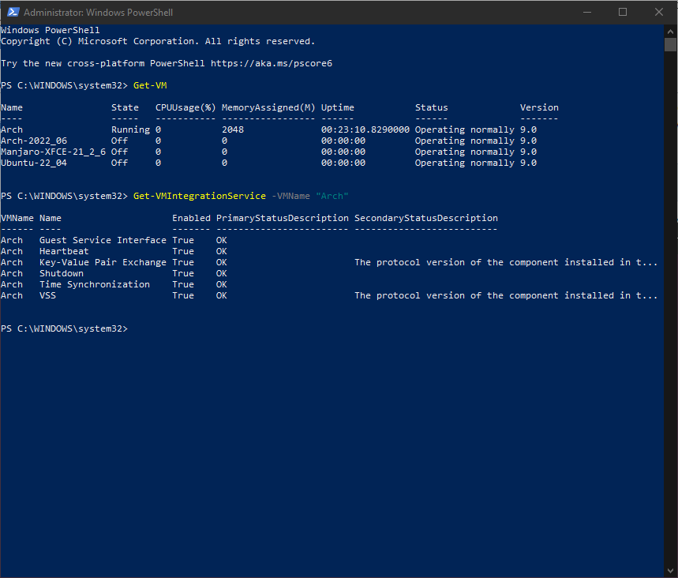</p>

### [Install, `xrdp`](#instxrdp)

> provides a graphical login to remote machines using RDP (Microsoft Remote Desktop Protocol).
http://xrdp.org

```console
$ yay -S xrdp
```

### [Install, `xorgxrdp`](#instxorgxrdp)

> is a collection of modules to be used with a pre-existing X.Org install to make the X server act like X11rdp. Unlike X11rdp, you don't have to recompile the whole X Window System. Instead, additional modules are installed to a location where the existing Xorg installation would pick them.
https://github.com/neutrinolabs/xorgxrdp

```console
$ yay -S xorgxrdp
```

### [Install, `pulseaudio-module-xrdp`](#instpulsexrdp)

> xrdp implements Audio Output redirection using PulseAudio, which is a sound system used on POSIX operating systems.
https://github.com/neutrinolabs/pulseaudio-module-xrdp

```console
$ yay -S sbc
$ yay -S pulseaudio-module-xrdp
```

_Note: sbc is required in order to successfully build pulseaudio-module-xrdp.._

### [configure the XRDP server..](#confxrdp)

> By default, you may suffer from poor mouse and desktop experience.
Enhanced session mode features better mouse and video experience and integrated clipboard.

```console
$ cd Downloads
$ git clone https://github.com/Microsoft/linux-vm-tools
$ cd linux-vm-tools/arch
$ sudo ./install-config.sh
```

_Note: only need to configure the xrdp server, no need for makepkg.sh..._

### [Edit `~/.xinitrc` to start Desktop Environment](#editxinitrc)

copy the system default xinitrc file, to home folder..

```console
$ cp /etc/X11/xinit/xinitrc ~/.xinitrc
```

comment out the last five lines, from twm.. to the, exec.. & add..at EOF..

```
exec startxfce4
```

to start xfce4-Desktop without `dbus_lanuch`, <b>`dbus-x11`</b> has to be installed & <b>`dbus`</b> removed..

```console
$ yay -S dbus-x11
```

###### https://trendoceans.com/solved-failed-to-execute-child-process-dbus-launch-no-such-file-or-directory-while-x-forwarding/

Shutdown virtual machine..

> Shutdown Arch virtual machine, and then using PowerShell (run as Administrator),<br>
you need to enable `hv_sock` on your VM:

```powershell
Set-VM -VMName __Your_Arch_Machine__ -EnhancedSessionTransportType HvSocket
```

replace __Your_Arch_Machine__ with your virtual machine name.. ie.. Arch..

```powershell
Set-VM -VMName Arch -EnhancedSessionTransportType HvSocket
```

Start & Connect to virtual machine..

## <p align="center">[Start virtual machine & Enable Enhanced Session Mode](#enhsessionmode)</p>

<p align="center"><a href="https://youtu.be/8R3ZZj5bMX4" target="_blank">
 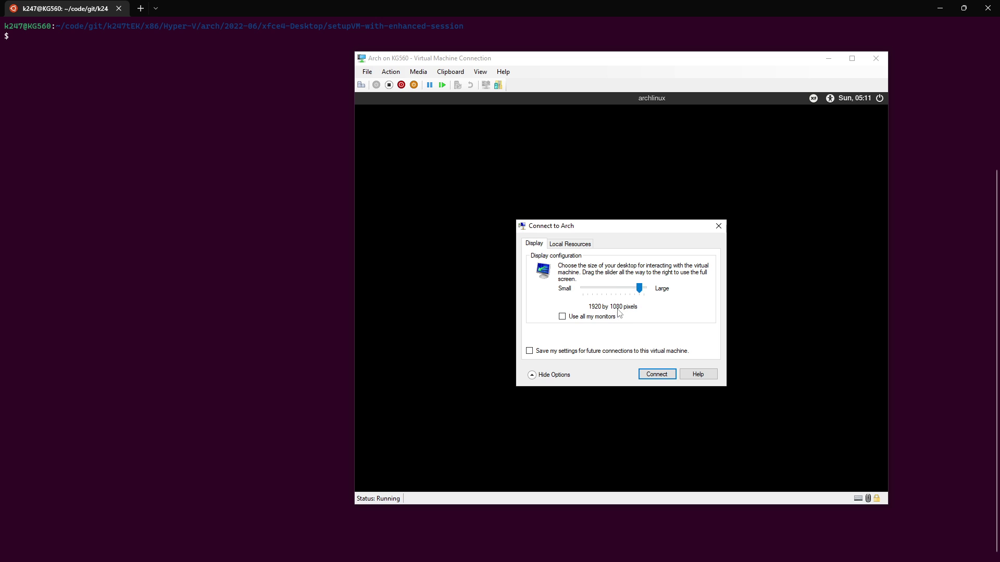</a></p>

_note: clipboard and file sharing will work, but sound server will fail to start on xrdp and will have to be started manually, with `pulseaudio --start` command.._

### [pulseAudio Sound Server](#pulseaudiosrv)

even though `pulseaudio-module-xrdp` has been installed, the pulseAudio Server on startup, is setup for Xorg on display:0, but xrdp is set on display:10.. so you have to disable pulseAudio Sound System(`start-pulseaudio-x11`) from Session and Startup & create a new entry..

```
pulseaudio --start
```

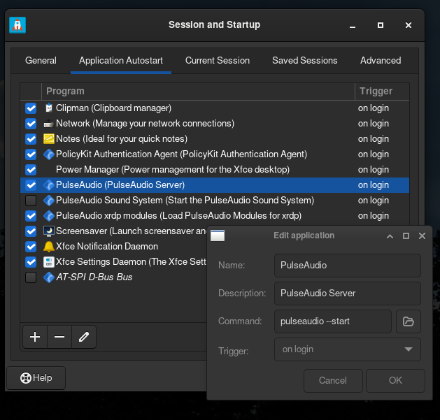<br>
logout & back in again.. and that should fix the sound.. ;-]..<br><br>

As of 24th June 20222 `pulseaudio` was updated to `16.1-1`, this breaks xrdp sound, you will have to downgrade `libpulse` & `pulseaudio` to `16.0-1`, and add both to pacman ignore package..

```console
$ sudo nano /etc/pacman.conf
```

```
...
[options]
IgnorePkg = libpulse pulseaudio
...
```

### [downgrade Pacman package](#downgradepacman)

install `downgrade` from `AUR`,

```console
$ yay -S downgrade
```

now you can downgrade both `libpulse` and `pulseaudio`.. to `16.0-1`

```console
$ sudo downgrade libpulse pulseaudio
```

Restart virtual machine.. and that should fix the sound.. again..

or.. you can just live without sound on xrdp & keep on updating VM until `pulseaudio-module-xrdp` or `pulseaudio` gets updated.. again.. ;-].. welcome to arch..

<br>

## [polkit & xfce-Desktop with xrdp](#polkitxfcexrdp)

ref: https://wiki.archlinux.org/title/Polkit

these three don't play nice with each other.. sooo will have to add some rules for polkit..<br>
but please be adviced..<br>
#### <b>THIS SHOULD NOT BE DONE ON PRODUCTIONS SYSTEMS...</b>

### [Bypass password prompt - Globally](#bypassprompt)

> Create the following file as root:

```console
$ sudo nano /etc/polkit-1/rules.d/49-nopasswd_global.rules
```

```
/* Allow members of the wheel group to execute any actions
 * without password authentication, similar to "sudo NOPASSWD:"
 */
polkit.addRule(function(action, subject) {
    if (subject.isInGroup("wheel")) {
        return polkit.Result.YES;
    }
});
```

> Replace wheel by any group of your preference.<br>
This will result in automatic authentication for any action requiring admin rights via Polkit. As such, be careful with the group you choose to give such rights to.<br><br>
 There is also AUTH_ADMIN_KEEP which allows to keep the authorization for 5 minutes. However, the authorization is per process, hence if a new process asks for an authorization within 5 minutes the new process will ask for the password again anyway.<br>

for more info, have a read of blog post below..

> ##### The general procedure to fix this is to figure out what polkit action is being denied by polkit, <br> https://c-nergy.be/blog/?p=12073

<br>

### [Disable suspend and hibernate](#suspendhibernate)

> The following rule disables suspend and hibernate for all users.

```console
$ sudo nano /etc/polkit-1/rules.d/10-disable-suspend.rules
```

```
polkit.addRule(function(action, subject) {
    if (action.id == "org.freedesktop.login1.suspend" ||
        action.id == "org.freedesktop.login1.suspend-multiple-sessions" ||
        action.id == "org.freedesktop.login1.hibernate" ||
        action.id == "org.freedesktop.login1.hibernate-multiple-sessions")
    {
        return polkit.Result.NO;
    }
});
```

and then.. mask.. `sleep.target`, `suspend.target`, `hibernate.target` &  `hybrid-sleep.target`

```console
$ sudo systemctl mask sleep.target suspend.target hibernate.target hybrid-sleep.target
```

check status..

```console
$ sudo systemctl status sleep.target suspend.target hibernate.target hybrid-sleep.target
```

Reboot virtual machine..

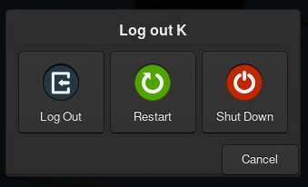<br>no more suspend / hibernate or Hybrid-sleep..

#### [xorg packages..](#xorgpkgs)

<pre><code>$ sudo pacman -S xorg-xhost xorg-xdpyinfo xorg-xdriinfo xorg-xlsclients \
xorg-xvinfo xorg-xvinfo xorg-font-util --needed</code></pre>

have to also edit `~/.bashrc`, and add at EOF..

```
xhost +local:root > /dev/null 2>&1
```

save and exit, then source the `.bashrc` file or logout / login again..

#### [dbus packages..](#dbuspkgs)

```console
$ sudo pacman -S accountsservice
```

not sure if this is needed, but found related `dbus` error in logs..<br><br>

## [caja File Manger](#cajafileman)

```console
$ sudo pacman -S caja caja-open-terminal caja-sendto caja-xattr-tags
```

### [thunar Root File Manager](#thunarroot)

<p align="center"></p>

#### create Custom Action..

from edit menu..<br>

<br>

```
pkexec thunar %f --display :10.0
```

the display variable, is hard coded here.. `:10.0` not good.. as this will fail in xorg session, as display there, is set to :`0.0`, I can not figure out how to pass --display the env DISPLAY variable.. have tried..

```
export DISPLAY; pkexec thunar %f --display=DISPLAY
```

~~but failed.. tbc...~~ strike that..

```
pkexec thunar %f --display $DISPLAY
```

works.. ;-]... sometimes the `$`implest things are the most profound..<br><br>

## [File managers & Network scanning](#filemanscan)

thunar and caja, both will fail to find any network shares until the required packages `gvfs-smb`, `cifs-utils` are installed.. first, optionally.. enable.. avahi-daemon.. https://www.avahi.org

```console
$ sudo systemctl enable --now avahi-daemon
```

and install Avahi's required packages, `pygtk` and `python-dbus`..

```console
$ sudo pacman -S avahi python-dbus --needed
$ yay -S pygtk
```

then install samba server with `gvfs` & `cifs` packages..

> For better performance (and to avoid other issues with abstraction layers), it’s recommended to use the cifs module method (via fstab or systemd), rather than GVFS/KIO (activated from within your GUI file manager).<br>
https://forum.manjaro.org/t/access-windows-11-shared-folder-from-manjaro-kde-linux/113213/7<br>

```console
$ sudo pacman -S samba smbclient gvfs gvfs-smb cifs-utils nmap --needed
```

_Note: samba is not required, if all you want is to use the client to connect to other network shares..<br>
just make sure there is an empty `smb.conf` file.._

```console
$ sudo mkdir /etc/samba
$ sudo touch /etc/samba/smb.conf
```

Reboot virtual machine..

### [Configure Samba server](#confsamba)

ref: https://wiki.archlinux.org/title/Samba,<br>
https://wiki.manjaro.org/index.php/Using_Samba_in_your_File_Manager,<br>
https://forum.manjaro.org/t/root-tip-basic-samba-setup-and-troubleshooting/100420/1<br>

create a samba server group, `sambashare`, add user `k247` to that group & set a samba password for that user..

```console
$ sudo groupadd -r sambashare
$ sudo usermod -a -G sambashare k247
$ sudo smbpasswd -a k247
```

then check SAM database with

```console
$ sudo pdbedit -L -v
```

logout & login again, then check with `id`, if user `k247` is in sambashare group..

<pre><code>[k247@archlinux ~]
$ id
uid=1000(k247) gid=1000(k247) groups=1000(k247),970(sambashare),998(wheel)
[k247@archlinux ~]
$
</code></pre>

A documented example, `smb.conf.default` can be found at the Samba git repository..
###### https://git.samba.org/samba.git/?p=samba.git;a=blob_plain;f=examples/smb.conf.default;hb=HEAD<br>
 download a copy to `/etc/samba/smb.conf.default` then..

```console
$ sudo cp /etc/samba/smb.conf.default /etc/samba/smb.conf
```

and edit `smb.conf`,

```console
$ sudo nano /etc/samba/smb.conf
```

<pre><code>...
...
[global]

# workgroup = NT-Domain-Name or Workgroup-Name, eg: MIDEARTH
   workgroup = WORKGROUP
   # client min protocol = NT1    ### use for legacy devices
   client min protocol = SMB2
   server min protocol = SMB2
;  server max protocol = SMB3
...
...
...
;  log file = /usr/local/samba/var/log.%m
   log file = /var/log/samba/log.%m
...
...
#
[public]
    path = /srv/samba/public
    public = yes
    only guest = yes
    writable = yes
    printable = no
#
[k247Public]
    path = /home/k247/Public
    public = yes
    only guest = no
    writable = yes
    printable = no
#
[k247SMB]
    path = /home/k247
    read only = no
    browseable = no
    force create mode = 0660
    force directory mode = 2770
    valid users = @k247 @sambashare
#EOF
</code></pre>

create samba server public folder.. & allow samba group ownership..

```console
$ sudo mkdir -p /srv/samba/public
$ sudo chown root:sambashare /srv/samba/public/
$ sudo chmod -R ugo+rwx /srv/samba/public/
```

for [ k247Public ] folder..

```console
$ sudo chown k247:sambashare /home/k247/Public/
$ sudo chmod -R 0770 /home/k247/Public/
```

check with `testparm` for syntactic errors in `smb.conf` file..

```console
$ sudo testparm
```

Now, enable and start `smb.service` and `nmb.service`

```console
$ sudo systemctl enable --now smb nmb
```

to access samba shares through `caja` & `thunar`, Press [Ctrl+l] and enter:<br>

```
smb://servername/share
```

in the location bar to access network share. For command line terminal use..

```console
$ smbclient -L //192.168.0.100 -U k247
```

<pre><code>k247@yoga700-11isk:~
$ smbclient -L //192.168.0.100 -U k247
Enter WORKGROUP\k247's password:

        Sharename       Type      Comment
        ---------       ----      -------
        public          Disk
        k247Public      Disk
        IPC$            IPC       IPC Service (Samba Server)
SMB1 disabled -- no workgroup available
k247@yoga700-11isk:</code></pre>

https://help.ubuntu.com/community/Samba/SambaClientGuide<br><br>

## [Whisker Menu & xfce-Desktop Panel](#whiskermenu)

by default, arch linux 2022-06 does not use Whisker menu &<br> you will have to manually add it to the desktop panel.

https://docs.xfce.org/panel-plugins/xfce4-whiskermenu-plugin/start

<p align="left">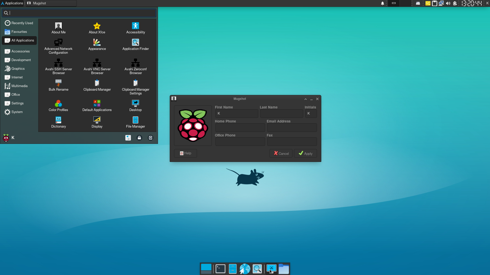</p>

###### https://www.pragmaticlinux.com/2021/03/install-and-configure-the-whisker-menu-as-your-xfce-start-menu/

the above links, have everything you need to know about customizing the Whisker menu, including adding super / winkey, as shortcut key to open menu.. the only fix needed is to install `mugshot` package from the `AUR`..

### [Mugshot & xfce-Desktop](#mugshotid)

 > is a lightweight user configuration utility for Linux designed for simplicity and ease of use. Quickly update your personal profile and sync your updates across applications.<br>
 https://github.com/bluesabre/mugshot

```console
$ yay -S mugshot
```

_Note: the user icon image file is `~/.face`_

### [xfce4 Places plugin](#xfceplaces)

https://docs.xfce.org/panel-plugins/xfce4-places-plugin/start

install xfce places plugin from `AUR`..

```console
$ yay -S xfce4-places-plugin
```

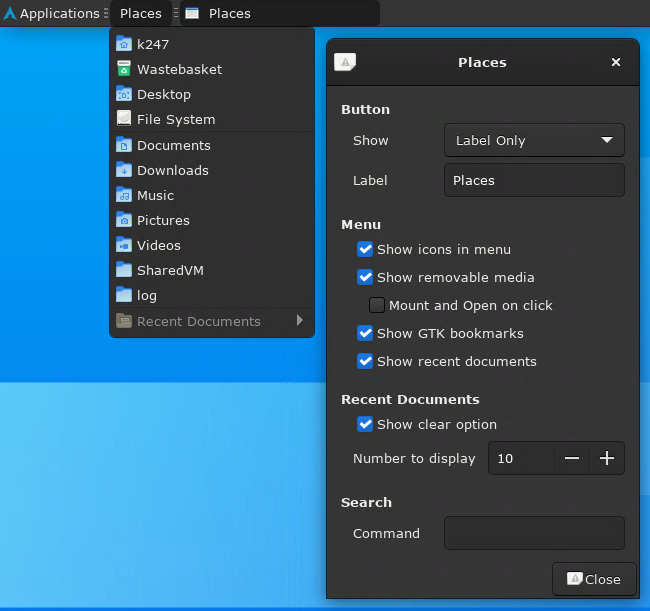

then add to panel..

### [xfce-Desktop panel Action Buttons](#actionbuttons)

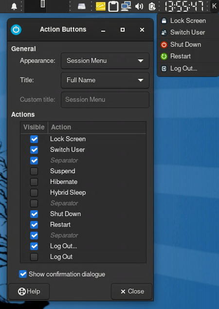<br>
select Restart & de-select Suspend..

### [xfce-Desktop Wallpapers](#wallpapers)

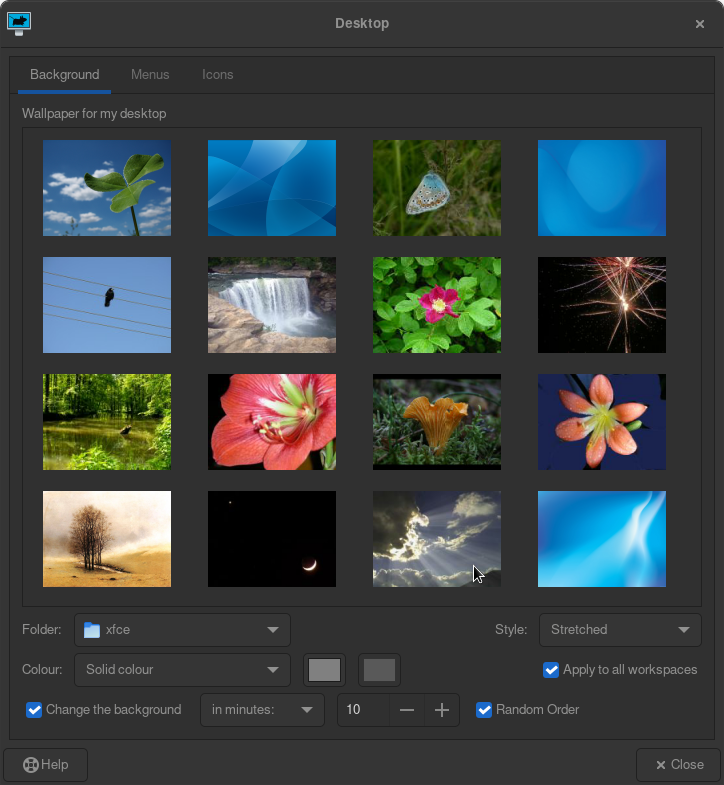

### [xfce4-screensaver is spanning log with DPMS errors..](#xfcescreensave)

```
org.xfce.ScreenSaver[452]: Xlib:  extension "DPMS" missing on display ":10.0"
```

sooo just remove it & enable Ramdom Order wallpapers every 10 mins.. ;-]...

```console
$ sudo pacman -R xfce4-screensaver
```

thats one less thing to start.. assigned only 2GB of RAM to this VM..

### [clipman - Clipboard Manager](#clipman)<br>

 set max menu items to 10, disabled Remember last copied image before disabling Remember history.. as it was causing the VM to hang for about 15secs every time there was a picture there..<br>

<p align="center">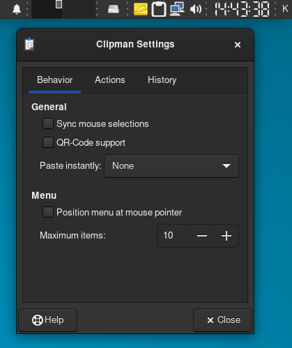
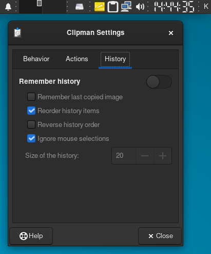</p>

### [xfce4-notes-plugin - Notes](#xfcenotes)

can't seem to find setting to change background colour..<br>
online search, suggests to use style sheets..<br>
 temp fix.. is to hard code it.. find in `gtk-main.css`

```
@define-color theme_base_color @notes_bg_color
```

& set color to `#828179` / break gtk-main.css ????

```console
$ sudo nano /usr/share/xfce4-notes-plugin/gtk-3.0/gtk-main.css
```

```
@define-color theme_base_color @notes_bg_color #828179;
```

save & exit.. right click on notes icon on panel, & click remove.. then run notes again from application menu..<br>

[<p align="center">](https://youtu.be/0hiUuL5uTKc?t=11)</p>

now.. I don't know if this is setting the background colour, or braking the 
`@notes_bg_color` variable,<br>
and it is the good coding.. that is.. defaulting to the user's set preference, ie.. Dark mode..<br>
well.. for now.. this works for notes 1.9.0.

## [Eye candy](#eyecndy)

https://wiki.archlinux.org/title/Category:Eye_candy

```console
$ sudo pacman -S archey3 fortune-mod cmatrix --needed
```

### [Microsoft fonts](#msfonts)

https://wiki.archlinux.org/title/Microsoft_fonts

```console
$ yay -S ttf-ms-fonts
```

### [GTK and Qt themes](#gtkqt)

https://wiki.archlinux.org/title/Uniform_look_for_Qt_and_GTK_applications<br>
tbc..

### [Multimedia apps](#multimedia)

https://wiki.archlinux.org/title/List_of_applications/Multimedia

```console
$ sudo pacman -S vlc gst-libav
```

_Note: snap vlc.. does not play nice with xrdp.._

### [Web browsers](#webbrowsers)

https://wiki.archlinux.org/title/List_of_applications#Web_browsers

```console
$ sudo pacman -S opera
```

useful bash shell tools..

```console
$ sudo pacman -S tree arp-scan nano-syntax-highlighting --needed
```

### [bash Shell & Tumx - Session management](#bashtmux)

Home Folder dotfiles:
[.bashrc](dotfiles/.bashrc), [.bash_profile](dotfiles/.bash_profile), [.tmux.conf](dotfiles/.tmux.conf), [.nanorc](dotfiles/.nanorc), [.dir_colors](dotfiles/.dir_colors)

create bash shell folders & fix Home dotfiles permisstions:

```console
$ mkdir -p ~/code ~/bin ~/temp
$ sudo chmod 644 .dir_colors .nanorc .tmux.conf .bashrc
```

fix root dotfile & create root Home folders:

```console
$ sudo su -
# mkdir -p ~/code ~/bin ~/temp
# xdg-user-dirs-update
# cd /home/k247
# cp .bashrc .bash_profile .dir_colors .nanorc .tmux.conf /root
# exit
$ sudo su -
# ll
```

<pre><code>[archlinux ~]
# ll
total 108K
drwx------ 19 root root 4.0K Jun 21 06:37 ./
drwxr-xr-x 17 root root 4.0K Jun 18 18:45 ../
-rw-------  1 root root  904 Jun 21 06:58 .bash_history
-rw-r--r--  1 root root  174 Jun 21 06:58 .bash_profile
-rw-r--r--  1 root root 4.0K Jun 21 06:58 .bashrc
drwxr-xr-x  2 root root 4.0K Jun 21 06:31 bin/
drwx------  6 root root 4.0K Jun 19 10:14 .cache/
drwxr-xr-x  2 root root 4.0K Jun 21 06:31 code/
drwx------  7 root root 4.0K Jun 21 06:35 .config/
drwx------  3 root root 4.0K Jun 19 10:14 .dbus/
drwxr-xr-x  2 root root 4.0K Jun 19 12:05 Desktop/
-rw-r--r--  1 root root 4.8K Jun 21 06:58 .dir_colors
drwxr-xr-x  2 root root 4.0K Jun 21 06:35 Documents/
drwxr-xr-x  2 root root 4.0K Jun 21 06:35 Downloads/
drwx------  3 root root 4.0K Jun 18 18:46 .gnupg/
drwxr-xr-x  2 root root 4.0K Jun 18 18:57 insCONFIG/
-rw-------  1 root root   20 Jun 20 10:57 .lesshst
drwxr-xr-x  3 root root 4.0K Jun 19 10:14 .local/
drwxr-xr-x  2 root root 4.0K Jun 21 06:35 Music/
-rw-r--r--  1 root root  158 Jun 21 06:58 .nanorc
drwxr-xr-x  2 root root 4.0K Jun 21 06:35 Pictures/
drwxr-xr-x  2 root root 4.0K Jun 21 06:35 Public/
drwxr-xr-x  2 root root 4.0K Jun 21 06:31 temp/
drwxr-xr-x  2 root root 4.0K Jun 21 06:35 Templates/
-rw-r--r--  1 root root 1.3K Jun 21 06:58 .tmux.conf
drwxr-xr-x  2 root root 4.0K Jun 21 06:35 Videos/
[archlinux ~]
# exit
</code></pre>

_Note: `.insCONFIG` folder contains the saved installation files used by archinstall.._<br><br>

## [Tmux Plugin Manager & Tmux Resurrect](#tmpresurrect)

https://github.com/tmux-plugins/tpm, https://github.com/tmux-plugins/tmux-resurrect

Clone TPM:

```console
$ cd
$ git clone https://github.com/tmux-plugins/tpm ~/.tmux/plugins/tpm
```

### [install Tmux plugins](#tmuxplugins)

create or download [~/.tmux.conf](dotfiles/.tmux.conf) & run tmux session..

```console
$ tmux
```

Press [prefix] + I (capital i, as in Install) to fetch the plugins.<br>
soooo [Ctrl] + [b] then [Shift] + [i], esc & exit after install of plugins..<br>
now both plugins should be installed.. run tmux.. set layout.. and save it with..<br>

<a href="https://youtu.be/BVmGL96zq1g " target="_blank">
 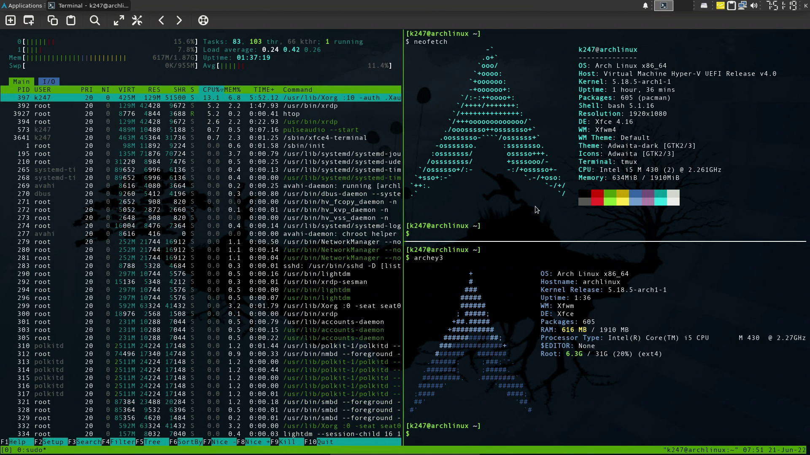
</a><br>
[Ctrl] + [b] then [s] & to restore session layout [Ctrl] + [b] then [r]..<br>
<br>

## [install snap & Flatpak](#snapflatpak)

https://snapcraft.io/docs/installing-snap-on-arch-linux, https://flatpak.org/setup/Arch

```console
$ sudo pacman -S flatpak
```

then insatll snap..

```console
$ yay -S snapd
```

start and enable the snapd service..

```console
$ sudo systemctl enable --now snapd
```

Reboot virtual machine..

test snap,

```console
$ snap list
$ snap install hello-world
$ hello-world
$ whereis hello-world
```

_Note: some apps will not start in xrdp.. have to look into snap with xrpd.. tbc.._
<br><br>

## [install Pamac - package Manager, & setup with AUR](#pamacaur)

```console
$ yay -S pamac-aur
```

<p align="center"></p>

_Note: pamac-all from `AUR`, failed to build on arch.. its always safer to use ssh session or tty console for major updates.._

#### [List of installed packages](#lstinstalledpkgs)

> Maintain a list of all installed packages so that if a complete re-installation is inevitable, it is easier to re-create the original environment.<br>
https://wiki.archlinux.org/title/Pacman_tips#List_of_installed_packages

```console
$ pacman -Qqe > temp/pkglist.txt
```

> Note:<br>
With option -t,<br> 
the packages already required by other explicitly installed packages are not mentioned.<br>
If reinstalling from this list they will be installed but as dependencies only.<br>
With option -n,<br>
foreign packages (e.g. from AUR) would be omitted from the list.<br>
Use comm -13 <(pacman -Qqdt | sort) <(pacman -Qqdtt | sort) > optdeplist.txt<br>
to also create a list of the installed optional dependencies<br>
which can be reinstalled with --asdeps.<br>
Use pacman -Qqem > foreignpkglist.txt<br>
to create the list of AUR and other foreign packages that have been explicitly installed.<br>

#### [Pacman database](#pacmandb)

See pacman/Tips and tricks#Back up the pacman database.
https://wiki.archlinux.org/title/Pacman/Tips_and_tricks#Back_up_the_pacman_database

install extra packages..

```console
$ sudo pacman -S expac moreutils pacgraph fzf pacutils
```

FIX Pamac.. if pamac ever fails to update categories..

```console
$ sudo pacman -Syu archlinux-appstream-data
```

### [Mirrors & pacman](#mirrorspacman)

https://wiki.archlinux.org/title/Mirrors<br>
use the Pacman Mirrorlist Generator page.<br>
https://archlinux.org/mirrorlist/<br>

Pacman stores its downloaded packages in `/var/cache/pacman/pkg/`
https://wiki.archlinux.org/title/Pacman#Cleaning_the_package_cache

```console
$ du -sh /var/cache/pacman/pkg/
```

1.3G in `/var/cache/pacman/pkg/` hhhhhmm..

https://wiki.archlinux.org/title/Pacman#Cleaning_the_package_cache<br>
deletes all cached versions of installed and uninstalled packages,<br>
except for the most recent three, by default:

```console
$ sudo  paccache -r
```

#### [System backup](#systembackup)

https://wiki.archlinux.org/title/System_backup<br>

Using `rsync`
See rsync#As a backup utility.<br>
https://wiki.archlinux.org/title/Rsync#As_a_backup_utility

```console
$ sudo pacman -S rsync
```

### [ooh.. install the F..ing manual..](#installman)

```console
$ sudo pacman -S man
```

<br>

### [AisleRiot Solitaire & `LC_ALL`](#solandlcall)

installed AisleRiot Solitaire (aisleriot) 3.22.23-2 from Pamac, with no Optional Dependencies.. system locale is setup for UK, `en_GB.UTF-8`.. but `aisleriot` or `sol`, requires `en_US.UTF-8`..

```cosole
$ env LC_ALL=en_GB.UTF-8 sol
Non UTF-8 locale (ANSI_X3.4-1968) is not supported!
```

from https://wiki.archlinux.org/title/locale

### LC_ALL: troubleshooting

>The locale set for this variable will always override LANG and all the other LC_* variables, whether they are set or not.<br><br>
LC_ALL is the only LC_* variable which cannot be set in locale.conf files: it is meant to be used only for testing or troubleshooting purposes,

```console
$ env LC_ALL=en_US.UTF-8 sol
```

works, so you will have to edit the application menu.. `aisleriot`

<p align="center">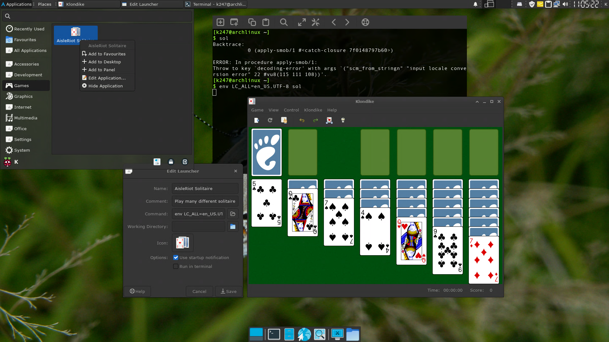</p>

<br>

## [setup i3 with xfce-Desktop](#i3xfcedsk)

https://wiki.archlinux.org/title/I3

```console
$ sudo pacman -S i3-gaps i3status i3blocks i3lock
```

https://i3wm.org/docs/userguide.html, https://i3wm.org/docs

<a href="https://youtu.be/pDKqgbNQKqA " target="_blank">
 
</a><br>

#### background - Wallpaper manager for i3

```console
$ sudo pacman -S feh
```
_Note: [`chbkg`](dotfiles/bin/chbkg) shell script in `~/bin` folder.. uses `feh` and requires wallpapers be in `~/Pictures/backgrounds/`_

copy backgrounds from system folder `/usr/share/backgrounds/xfce/` to user home folder `~/Pictures/backgrounds/`

```console
$ cp /usr/share/backgrounds/xfce/* ~/Pictures/backgrounds/
```

#### picom - Compositor Manager

```console
$ sudo pacman -S picom
```

The default configuration is available in `/etc/xdg/picom.conf`..

```console
$ cp /etc/xdg/picom.conf ~/.config/i3/
```

ensure you have.. in `~/.config/i3/config`..

```console
picom --config ~/.config/i3/picom.conf
```

if you have problems with `vsync`.. not supported.. then..

```console
picom --no-vsync --config ~/.config/i3/picom.conf
```

#### dmenu - Application launcher

```console
$ sudo pacman -S dmenu
```

Note.. `LC_ALL` has to be set for `dmenu` to start..

```console
bindsym $mod+d exec --no-startup-id env LC_ALL=en_GB.UTF-8 dmenu_run -b
```

use `env LC_ALL=`.. in `~/.config/i3/config` file..<br><br>

### [chDE2_i3](dotfiles/bin/chDE2_i3) & [chDE2_xfce4](dotfiles/bin/chDE2_xfce4)

change desktop environment to i3 & change desktop environment to xfce-Desktop..<br>
<b>caution:</b> shell scripts will overwrite `.xinitrc` file in users home folder..<br>
& they require [xinitrc_i3](dotfiles/bin/xinitFiles/xinitrc_i3) & [xinitrc_xfce4](dotfiles/bin/xinitFiles/xinitrc_xfce4) be in `~/bin/xinitFiles`..<br>
The `.bash_profile` file adds the users home `bin` folder to the path variable..<br>
soooo, you can use.. ssh or terminal in VM to set desktop environment with chDE2..<br>
then.. logout & login.. to change session.. ;-]..

[<b>dotfiles</b>](dotfiles) folder.. contains `i3` configuration files in `.config` folder & shell scripts in `bin` folder..

```console
[k247@archlinux ~]
$ tree -L 2 -aph bin/ .config/i3*
[drwxr-xr-x 4.0K]  bin/
├── [-rwx------   74]  chbkg
├── [-rwx------  114]  chDE2_i3
├── [-rwx------  120]  chDE2_xfce4
└── [drwx------ 4.0K]  xinitFiles
    ├── [-rw-------  885]  xinitrc_i3
    └── [-rw-------  883]  xinitrc_xfce4
[drwx------ 4.0K]  .config/i3
├── [-rw-------  11K]  config
└── [-rw-r--r--  13K]  picom.conf
[drwx------ 4.0K]  .config/i3status
└── [-rw------- 1004]  config

0 directories, 1 file
[k247@archlinux ~]
$ 
```

<!--
<p align="center">
    // Your content
</p>
-->

Home Folder dotfiles:
[.bashrc](dotfiles/.bashrc), [.bash_profile](dotfiles/.bash_profile), [.tmux.conf](dotfiles/.tmux.conf), [.nanorc](dotfiles/.nanorc), [.dir_colors](dotfiles/.dir_colors)

<br>

## [logs - Hunting Errors](#logs)

https://wiki.archlinux.org/title/Systemd/Journal

```console
$ journalctl -b -0 | lnav
```

shows messages from the current boot,

<br>

## [Kernel module](#kernelmod)

https://wiki.archlinux.org/title/Kernel_module


<br>

## [General recommendations](#genrec)

https://wiki.archlinux.org/title/General_recommendations

---
#EOF