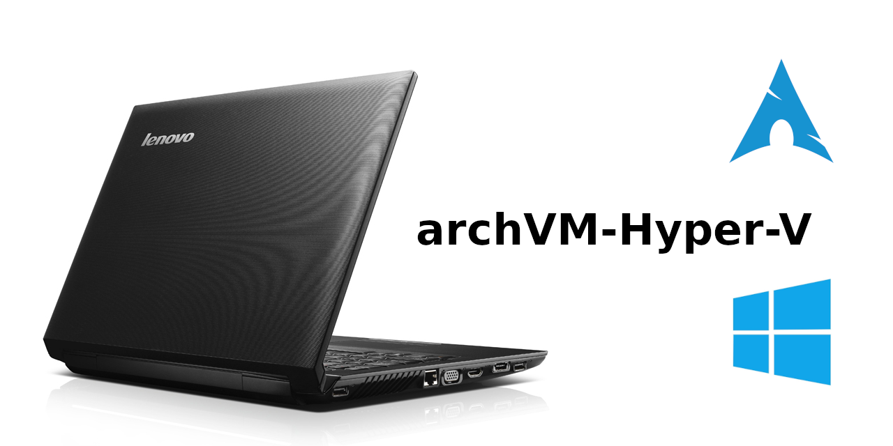
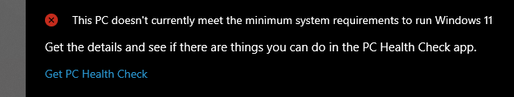

# [archVM-Hyper-V](#archvm-hyper-v)

## Arch Linux virtual machine on Windows10 Hyper-V with Enhanced Session Mode

[

](2022-06)

### 
[2022-07 - archlinux-2022.07.01-x86_64.iso](2022-06/) [current install]

### 2022-07 - pulseAudio in Xrdp working again..

---

#### 
[2022-06 - archlinux-2022.06.01-x86_64.iso](2022-06/) [first install]

### 2022-06 - let the fun begin..

### Host

- #### s/w

            Windows 10 Pro 21H2 OS Build 19044.1706
            WSL2 / Hypervisor Platform & Hyper-V enabled
- #### h/w 

            Lenovo Ideapad G560-M274YGE
            Intel Core i5-450M (2.40GHz, 2 cores - 4 threads)
            8GB (DDR3 1066MHz)
            NVIDIA GeForce 310M

unfortunately..

[

](#)

sooo, Desperately Seeking OS.. ;-]...

found.. [arch Linux](https://archlinux.org) 2022-06, xfce-Desktop install via archinstall...

### [Xfce Desktop Environment](https://wiki.archlinux.org/title/xfce) | [Xorg](https://wiki.archlinux.org/title/xorg) | [Xrdp](https://wiki.archlinux.org/title/xrdp) | [pulseaudio-module-xrdp](https://aur.archlinux.org/packages/pulseaudio-module-xrdp)

ref: https://www.xfce.org

###### 
[Acknowledgments & Thanks](2022-06/Acknowledgments.md) | [License](LICENSE.txt) | 

---

#EOF