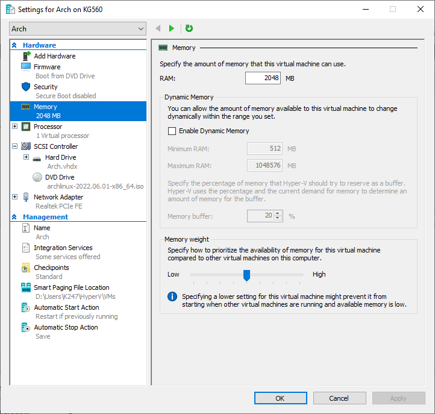
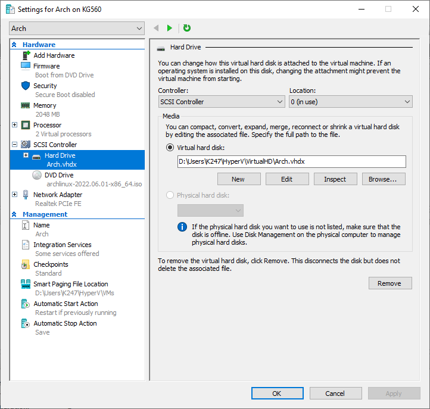
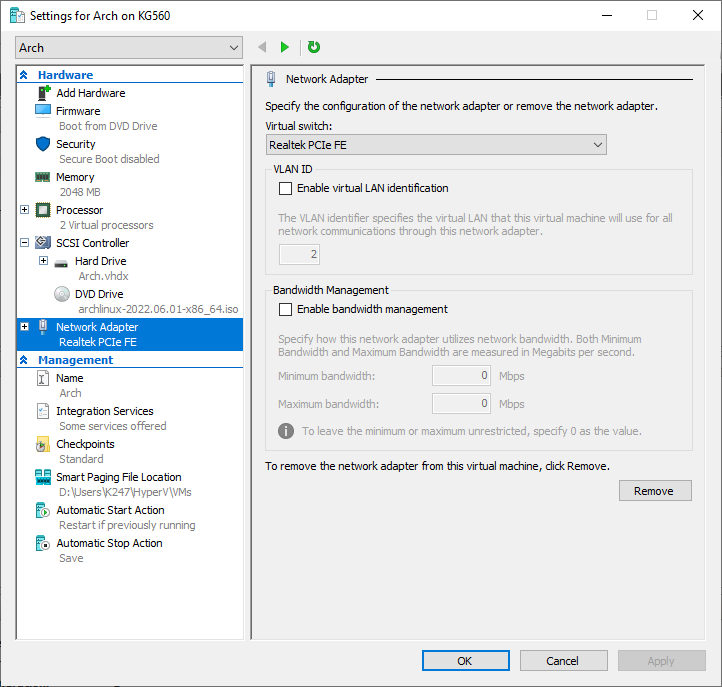
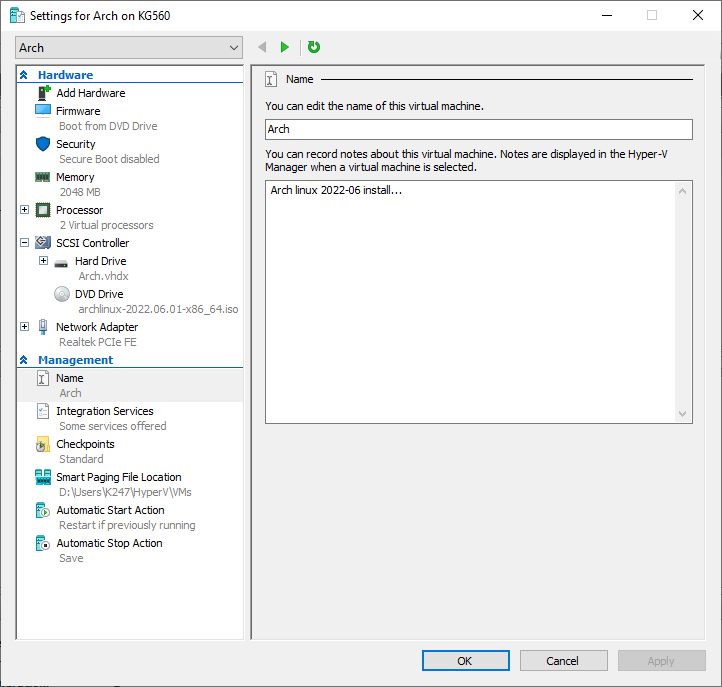
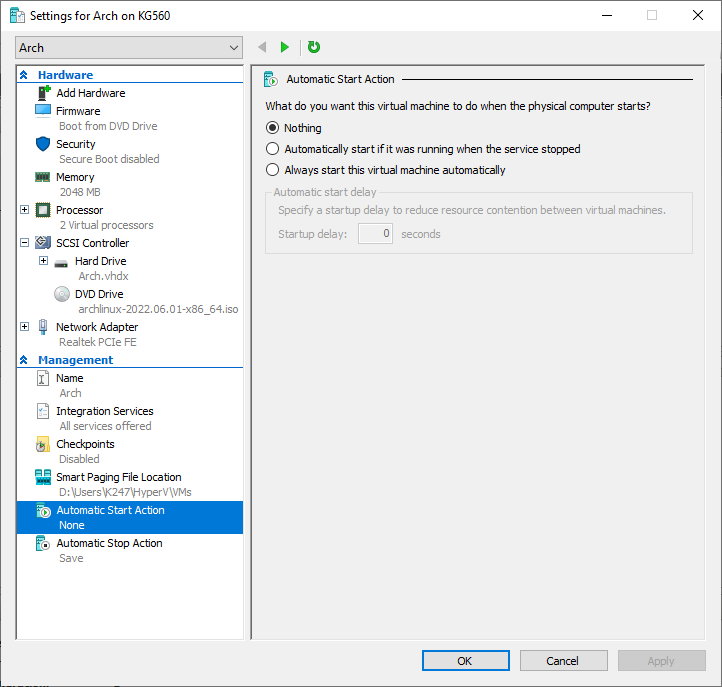
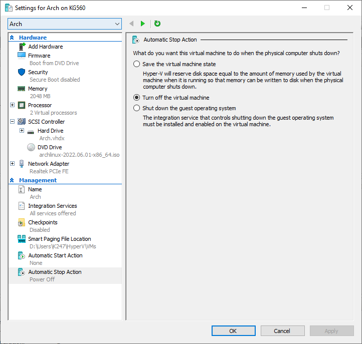

- ### [Setup Client](https://docs.microsoft.com/en-us/virtualization/hyper-v-on-windows/quick-start/quick-create-virtual-machine)

    - #### Creating the virtual machine in Hyper-V Manager  

    - #### Specifying Hyper-V Generation 2 for a UEFI virtual machine  

 

 

 

 

 

    - #### Setting Hardware Firmware Boot order, ensure Network Adapter is last  

    - #### Disabling Secure Boot  

    - #### Disabling Dynamic Memory & Specifying RAM size 2048 MB  

    - #### Setting Number of virtual processors 2 cores  

    - #### Setting Hard Drive 32GB / DvD Drive & Network Adapter  

 

 

    - #### Setting Name 'Arch' & Description for virtual machine  

    - #### Enabling all Integrations Services  

    - #### Disabling Checkpoints  

    - #### Setting Automatic Start Action to Nothing  

    - #### Setting Automatic Stop Action to Power Off  

