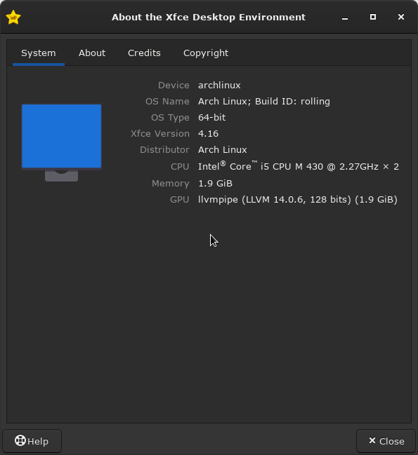
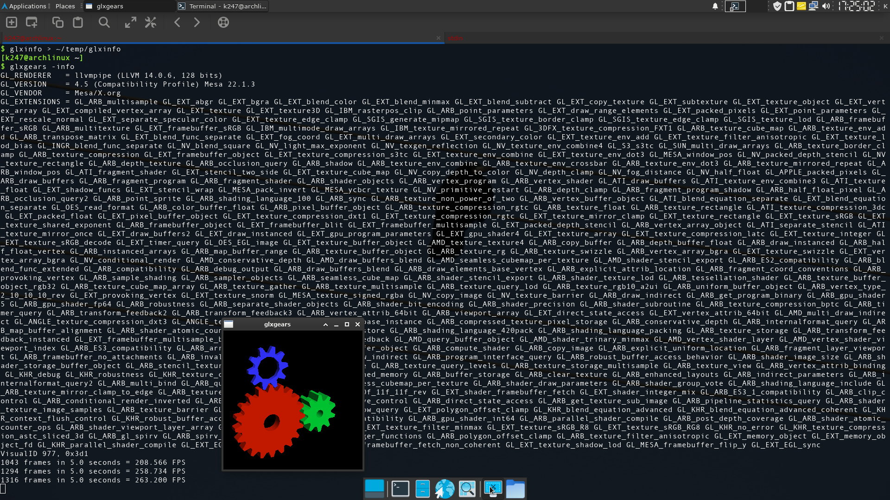

# Xrdp

ref: https://wiki.archlinux.org/title/xrdp

 ## Tips and tricks
 
 ### Graphical acceleration

 >For Xorg sessions, you can enable `OpenGL` and `Vulkan` graphical acceleration by installing `xorgxrdp-glamor` `AUR` for Intel and AMD GPUs and `xorgxrdp-nvidia` `AUR` for Nvidia GPUs.

```console
$ yay -S xorgxrdp-nvidia
```

Shutdown virtual machine..

##### [ Host s/w : Windows 10 Pro 21H2 OS Build 19044.1706. ]

<p align="left"> </p>

##### [ Host h/w : Lenovo Ideapad G560-M274YGE - Intel Core i5-450M (2.40GHz, 2 cores - 4 threads),<br>8GB (DDR3 1066MHz), NVIDIA GeForce 310M ]</p>

## [NVIDIA GeForce 310M](https://www.notebookcheck.net/NVIDIA-GeForce-310M.22439.0.html#:~:text=The%20Nvidia%20GeForce%20310M%20is,MHz%20and%20therefore%20slightly%20slower.)

```
NVIDIA System Information report created on: 06/13/2022 16:33:15
System name: KG560

[Display]
Operating System:       Windows 10 Pro, 64-bit
DirectX version:        11.0
GPU processor:          GeForce 310M
Driver version:         342.01
Direct3D API version:   10.1
CUDA Cores:             16
Core clock:             625 MHz
Shader clock:           1530 MHz
Memory data rate:       1580 MHz
Memory interface:       64-bit
Total available graphics memory: 4095 MB
Dedicated video memory: 512 MB DDR3
System video memory:    0 MB
Shared system memory:   3583 MB
Video BIOS version:     70.18.4B.00.06
IRQ:                    16
Bus:                    PCI Express x16
Device ID:              10DE 0A75 392D17AA

[Components]

NvGFTrayPluginr.dll     2.11.4.125          NVIDIA GeForce Experience
NvGFTrayPlugin.dll      2.11.4.125          NVIDIA GeForce Experience
nvui.dll                8.17.13.4201        NVIDIA User Experience Driver Component
nvxdsync.exe            8.17.13.4201        NVIDIA User Experience Driver Component
nvxdplcy.dll            8.17.13.4201        NVIDIA User Experience Driver Component
nvxdbat.dll             8.17.13.4201        NVIDIA User Experience Driver Component
nvxdapix.dll            8.17.13.4201        NVIDIA User Experience Driver Component
NVCPL.DLL               8.17.13.4201        NVIDIA User Experience Driver Component
nvCplUIR.dll            7.8.840.0           NVIDIA Control Panel
nvCplUI.exe             7.8.840.0           NVIDIA Control Panel
nvWSSR.dll              6.14.13.4201        NVIDIA Workstation Server
nvWSS.dll               6.14.13.4201        NVIDIA Workstation Server
nvViTvSR.dll            6.14.13.4201        NVIDIA Video Server
nvViTvS.dll             6.14.13.4201        NVIDIA Video Server
NVSTVIEW.EXE            7.17.13.4201        NVIDIA 3D Vision Photo Viewer
NVSTTEST.EXE            7.17.13.4201        NVIDIA 3D Vision Test Application
NVSTRES.DLL             7.17.13.4201        NVIDIA 3D Vision Module
nvDispSR.dll            6.14.13.4201        NVIDIA Display Server
NVMCTRAY.DLL            8.17.13.4201        NVIDIA Media Center Library
nvDispS.dll             6.14.13.4201        NVIDIA Display Server
PhysX                   09.13.1220          NVIDIA PhysX
NVCUDA.DLL              8.17.13.4201        NVIDIA CUDA 6.5.51 driver
nvGameSR.dll            6.14.13.4201        NVIDIA 3D Settings Server
nvGameS.dll             6.14.13.4201        NVIDIA 3D Settings Server
```

<br>

on Host.. from Nvidia Control Panel.. Manage 3D Settings.. Program Settings.. add Virtual Machine Connection..

<p align="center"></p>

Restart windows Host.. before restarting virtual machine and connecting to it..

from about XFCE application,

<p align="left"></p>

GPU is listed as.. llvmpipe (LLVM 13.0.1, 128 bits) (1.9 GiB)

Check to see if Direct rendering is enabled and working

```console
$ sudo glxinfo | grep direct
```

```
direct rendering: Yes
    GL_AMD_multi_draw_indirect, GL_AMD_pinned_memory, 
    GL_ARB_derivative_control, GL_ARB_direct_state_access, 
    GL_ARB_draw_elements_base_vertex, GL_ARB_draw_indirect, 
    GL_ARB_indirect_parameters, GL_ARB_instanced_arrays, 
    GL_ARB_map_buffer_range, GL_ARB_multi_bind, GL_ARB_multi_draw_indirect, 
    GL_AMD_draw_buffers_blend, GL_AMD_multi_draw_indirect, 
    GL_ARB_direct_state_access, GL_ARB_draw_buffers, 
    GL_ARB_draw_indirect, GL_ARB_draw_instanced, GL_ARB_enhanced_layouts, 
    GL_ARB_indirect_parameters, GL_ARB_instanced_arrays, 
    GL_ARB_map_buffer_range, GL_ARB_multi_bind, GL_ARB_multi_draw_indirect, 
    GL_EXT_direct_state_access, GL_EXT_draw_buffers2, GL_EXT_draw_instanced,
```

Check OpenGL Version,

```console
$ sudo glxinfo | grep OpenGL
```

```
OpenGL vendor string: Mesa/X.org
OpenGL renderer string: llvmpipe (LLVM 13.0.1, 128 bits)
OpenGL core profile version string: 4.5 (Core Profile) Mesa 22.1.2
OpenGL core profile shading language version string: 4.50
OpenGL core profile context flags: (none)
OpenGL core profile profile mask: core profile
OpenGL core profile extensions:
OpenGL version string: 4.5 (Compatibility Profile) Mesa 22.1.2
OpenGL shading language version string: 4.50
OpenGL context flags: (none)
OpenGL profile mask: compatibility profile
OpenGL extensions:
OpenGL ES profile version string: OpenGL ES 3.2 Mesa 22.1.2
OpenGL ES profile shading language version string: OpenGL ES GLSL ES 3.20
OpenGL ES profile extensions:
```

list.. `glxinfo` `-B`: brief output, print only the basics.

```console
$ glxinfo -B
```

```
name of display: :10.0
display: :10  screen: 0
direct rendering: Yes
Extended renderer info (GLX_MESA_query_renderer):
    Vendor: Mesa/X.org (0xffffffff)
    Device: llvmpipe (LLVM 13.0.1, 128 bits) (0xffffffff)
    Version: 22.1.2
    Accelerated: no
    Video memory: 1910MB
    Unified memory: no
    Preferred profile: core (0x1)
    Max core profile version: 4.5
    Max compat profile version: 4.5
    Max GLES1 profile version: 1.1
    Max GLES[23] profile version: 3.2
OpenGL vendor string: Mesa/X.org
OpenGL renderer string: llvmpipe (LLVM 13.0.1, 128 bits)
OpenGL core profile version string: 4.5 (Core Profile) Mesa 22.1.2
OpenGL core profile shading language version string: 4.50
OpenGL core profile context flags: (none)
OpenGL core profile profile mask: core profile

OpenGL version string: 4.5 (Compatibility Profile) Mesa 22.1.2
OpenGL shading language version string: 4.50
OpenGL context flags: (none)
OpenGL profile mask: compatibility profile

OpenGL ES profile version string: OpenGL ES 3.2 Mesa 22.1.2
OpenGL ES profile shading language version string: OpenGL ES GLSL ES 3.20
```

save full listing of `glxinfo`to users home `temp` folder & test `glxgears`..

```console
$ glxinfo > ~/temp/glxinfo
$ glxgears -info
```

<p align="left"></p>

I don't know why or how, but installing `xorgxrdp-nvidia` does improve xfce-Desktop performance in xrdp.. ;-]...<br><br>

### [Linux 5.14 will support Hyper-V DRM display driver](https://meterpreter.org/linux-5-14-will-support-hyper-v-drm-display-driver/), `hyperv_drm`

```console
$ uname -a && lsmod | grep hv
```

```
Linux archlinuxVM 5.18.7-arch1-1 #1 SMP PREEMPT_DYNAMIC Sat, 25 Jun 2022 20:22:01 +0000 x86_64 GNU/Linux
hv_netvsc             102400  0
hv_balloon             45056  0
hv_utils               57344  3
hv_sock                20480  1
vsock                  53248  5 hv_sock
hv_storvsc             28672  2
scsi_transport_fc      90112  1 hv_storvsc
hv_vmbus              155648  8 hv_balloon,hv_utils,hv_netvsc,hid_hyperv,hv_storvsc,hyperv_keyboard,hyperv_drm,hv_sock
```

List all loaded `drm` Drivers in Kernel,

```console
$ sudo dmesg | grep drm
```

```
[    0.277563] ACPI: bus type drm_connector registered
[    2.928498] systemd[1]: Starting Load Kernel Module drm...
[    2.982822] systemd[1]: modprobe@drm.service: Deactivated successfully.
[    2.983678] systemd[1]: Finished Load Kernel Module drm.
[    3.751008] hv_vmbus: registering driver hyperv_drm
[    3.751844] hyperv_drm 5620e0c7-8062-4dce-aeb7-520c7ef76171: [drm] Synthvid Version major 3, minor 5
[    3.751942] fb0: switching to hyperv_drm from EFI VGA
[    3.754706] [drm] Initialized hyperv_drm 1.0.0 2020 for 5620e0c7-8062-4dce-aeb7-520c7ef76171 on minor 0
[    3.774471] hyperv_drm 5620e0c7-8062-4dce-aeb7-520c7ef76171: [drm] fb0: hyperv_drmdrmfb frame buffer device
```

List all installed `mesa` packages,

```console
$ pacman -Q | grep mesa
```

```
libva-mesa-driver 22.1.2-1
mesa 22.1.2-1
mesa-utils 8.5.0-2
```

List all installed `nvidia` packages,

```console
$ pacman -Q | grep nvidia
```

```
xorgxrdp-nvidia 0.2.18-2
```

<br>

---
#EOF